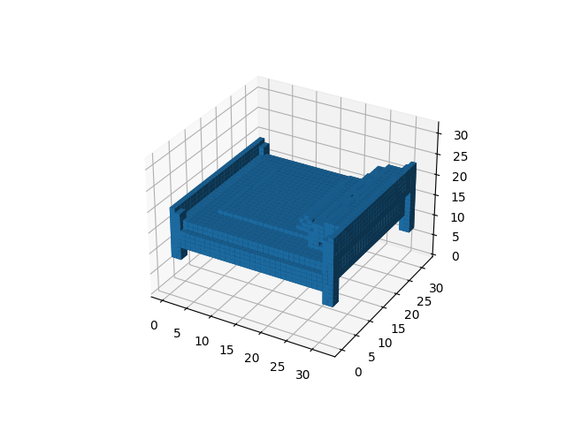
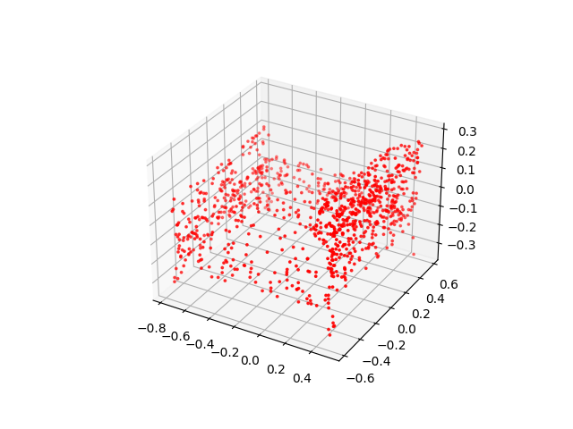

# 3D-multiview
Utility scripts to generate 3D multi-representation datasets. These scripts convert mesh data (`.off` files) in `ModelNet10`, `ModelNet40` into multiview images or voxels. To convert mesh into point clouds, we can simply use functions inside `pytorch_geometry`.

## Download Datasets
Simple run

```
./download.sh
```

in each scripts folder. The dataset will be downloaded to that folder.

## Mesh to Voxels

<p align="center" width=400>
    
</p>

To convert mesh to voxels, I used [`mesh-voxelization`](https://github.com/davidstutz/mesh-voxelization). For building `mesh-voxelization`, checkout the original repo. After building, move the binary in `mesh-voxelization/bin/voxelize` to `/usr/bin`.
   
To convert dataset from mesh representation to voxels, in each scripts folder run

```
scale.sh
voxelize.sh
```
A scaled mesh dataset `[dataset name]_scaled` and a voxel dataset `[dataset_name]_voxelized` will be created in the scripts folder.

## Mesh to Point Clouds

<p align="center" width=400>
    
</p>

We can use `trimesh.sample.sample_surface` to generate point cloud data from surface meshes. This can be done in the data pipeline during execution.